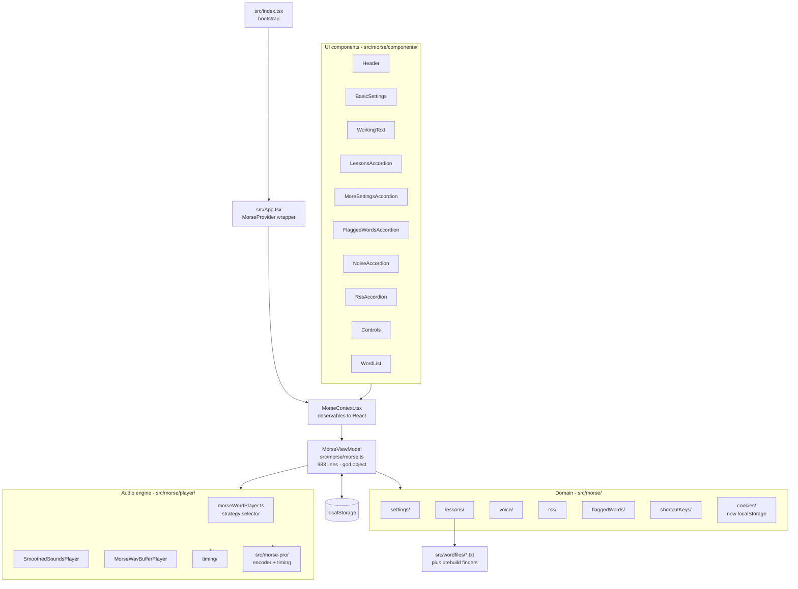
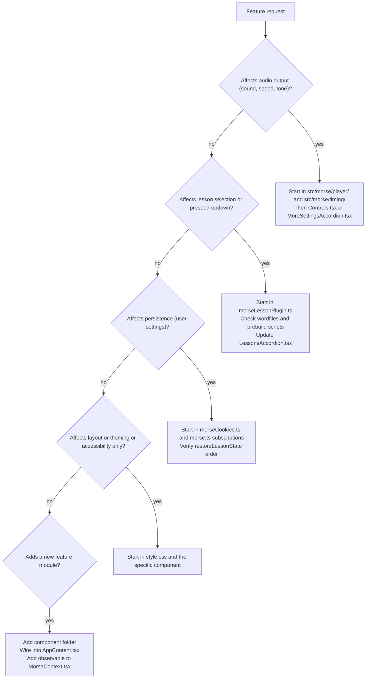

# Maintainer Review and Decision Map

## What this is

This document gives you a practical maintenance guide for this fork of MorseBrowser:
- Stability and browser/device confidence
- A feature-to-files decision map
- A prioritized improvement backlog
- A fast triage flow for incoming feature requests
- Known traps specific to this codebase

---

## 1. Executive verdict

**Stability: GOOD.**  
The app is a static, client-side React SPA with strong unit-test coverage (148 tests), no backend, no auth layer, and no runtime secret management. Deploy targets are static hosting (GitHub Pages + DigitalOcean), which keeps operational complexity low.

**Cross-browser/device summary:**
- **Desktop Chrome / Edge / Firefox / Safari**: Strong support
- **iOS Safari**: Mostly strong; user-gesture constraints for audio and speech still matter
- **Android Chrome / Samsung Internet**: Strong support
- **Legacy browsers (IE11 / old Safari)**: Out of scope, appropriately unsupported

**Top maintenance risks:**
1. `src/morse/morse.ts` (`MorseViewModel`) is large and central; changes ripple quickly.
2. `src/morse/context/MorseContext.tsx` is a large observable-to-React bridge with many mirrored fields.
3. Two audio implementations can drift behavior (`SmoothedSoundsPlayer` vs `MorseWavBufferPlayer`).
4. No E2E coverage for audio/TTS/full UI cascade behavior.
5. Lesson index drift risk between `src/wordfiles/*.txt` and `src/wordfilesconfigs/wordlists.json`.

---

## 2. Architecture at a glance

---

## 3. Feature -> files decision map

Use this as your routing table for feature requests.

### Playback / transport (play, pause, stop, rewind, counters)
- `src/morse/components/app/Controls.tsx`
- `src/morse/morse.ts` (`doPlay`, `doPause`, rewind/index methods, play-time state)
- `src/morse/context/MorseContext.tsx` (play/pause/time bridge state)
- `src/morse/utils/playingTimeInfo.ts`

### Tone generation / audio quality (frequency, smoothing, rise/decay)
- `src/morse/components/app/MoreSettingsAccordion.tsx`
- `src/morse/player/morseWordPlayer.ts`
- `src/morse/player/soundmakers/SmoothedSounds/SmoothedSoundsPlayer.ts`
- `src/morse/player/soundmakers/WavBufferPlayer/morseWavBufferPlayer.ts`
- `src/morse/settings/frequencySettings.ts`
- `src/morse-pro/morse-pro-cw-wave.js`, `src/morse-pro/morse-pro-player-waa.js`, `src/morse-pro/morse-pro-player-waa-light.js`

### Speed and timing (WPM/FWPM/Farnsworth/variable speed)
- `src/morse/components/app/BasicSettings.tsx`
- `src/morse/components/app/MoreSettingsAccordion.tsx`
- `src/morse/settings/speedSettings.ts`
- `src/morse/timing/morseTimingCalculator.ts`
- `src/morse/timing/ComputedTimes.ts`
- `src/morse/timing/UnitTimingsAndMultipliers.ts`
- Tests: `src/morse/timing/*.test.ts`

### Morse encoding / replacements / prosigns
- `src/morse-pro/morse-pro.js`
- `src/morse/utils/morseStringUtils.ts`
- `src/morse/utils/wordInfo.ts`

### LICW lessons cascade (TYPE/CLASS/GROUP/LESSON)
- `src/morse/components/app/LessonsAccordion.tsx`
- `src/morse/lessons/morseLessonPlugin.ts`
- `src/morse/morse.ts` (restore/persist interactions)
- `src/morse/morseLessonFinder.js` (generated)
- `src/wordfiles/*.txt`
- `src/wordfilesconfigs/wordlists.json`
- `checklessons.js`

### Settings presets
- `src/presets/config.json`
- `src/presets/sets/**`
- `src/presets/configs/**`
- `src/presets/overrides/**`
- `src/morse/morsePresetFinder.js` (generated)
- `src/morse/morsePresetSetFinder.js` (generated)
- `src/morse/lessons/morseLessonPlugin.ts`

### Persistence (localStorage, migration behavior)
- `src/morse/cookies/morseCookies.ts`
- `src/morse/morse.ts`
- `src/morse/settings/morseSettingsHandler.ts`

### Text-to-speech (voice)
- `src/morse/components/app/MoreSettingsAccordion.tsx`
- `src/morse/voice/MorseVoice.ts`
- `src/easyspeech/*`

### Noise generator
- `src/morse/components/noiseAccordion/NoiseAccordion.tsx`
- `src/morse/player/soundmakers/noisePlayback.ts`
- `src/morse/player/soundmakers/NoiseConfig.ts`
- Both sound-maker paths listed above

### RSS feature
- `src/morse/components/rssAccordion/RssAccordion.tsx`
- `src/morse/rss/morseRssPlugin.ts`
- `src/morse/rss/RssConfig.ts`
- `src/morse/rss/RssTitle.ts`

### Flagged words
- `src/morse/components/flaggedWordsAccordion/FlaggedWordsAccordion.tsx`
- `src/morse/flaggedWords/flaggedWords.ts`
- `src/morse/morse.ts` (log counters/state)

### Keyboard shortcuts
- `src/morse/components/app/KeyboardShortcuts.tsx`
- `src/morse/shortcutKeys/morseShortcutKeys.ts`

### Card display / reveal / shuffle / loop
- `src/morse/components/app/WordList.tsx`
- `src/morse/components/app/WorkingText.tsx`
- `src/morse/utils/cardBufferManager.ts`
- `src/morse/morse.ts`

### Theme / dark mode / header
- `src/morse/components/app/Header.tsx`
- `src/template.html`
- `src/css/style.css`

### Download audio
- `src/morse/components/app/Controls.tsx`
- `src/morse/morse.ts` (`doDownload`)
- `src/morse/player/wav/morseStringToWavBuffer.ts`
- `src/morse/player/wav/CreatedWav.ts`

### Build / CI / deploy
- `webpack.config.js`
- `prebuildLessons.ts`
- `prebuildPresetSets.ts`
- `prebuildPresets.ts`
- `.github/workflows/ci.yml`
- `.github/workflows/deploy.yml`
- `zipdist.ts`
- `checklessons.js`

### Tests
- `vitest.config.ts`
- `src/**/*.test.ts`

### Images/icons
- `src/morse/images/morseLoadImages.ts`
- `src/assets/*`

---

## 4. Concrete improvements (prioritized)

### P0 (high impact)
- Add a lesson-cascade smoke test that specifically verifies BC1 -> other class -> BC1 does not blank LESSON options.
- Start splitting `MorseViewModel` into focused controllers/modules while keeping the public API stable.
- Convert lesson index drift detection from warning-only into auto-regeneration (or hard-fail in CI).

### P1 (browser/device hardening)
- Add one-time audio unlock on first user gesture for iOS Safari reliability.
- Expose a user-visible wake lock capability state/fallback note.
- Add lightweight dev diagnostics for `MorseContext` subscription/re-render surfaces.
- Improve accessibility announcements around dynamic lesson dropdown changes.

### P2 (tech debt)
- Remove dead folder `src/morse/koextenders/`.
- Sunset cookie migration path in `morseCookies.ts` when no longer needed.
- Remove `js-cookie` and `@types/js-cookie` when migration fallback is retired.
- Reevaluate whether dual sound-maker implementations are still both required.
- Consider gradual TypeScript migration for `src/morse-pro/*.js`.
- Plan ESLint / typescript-eslint modernization.

### P3 (performance/polish)
- Run a one-time bundle analysis to validate polyfill and RSS parser cost.
- Keep PurgeCSS safelist tuned as classes evolve.
- Decide whether production source maps should remain publicly shipped.

### Security posture
- No backend and no embedded secrets: strong baseline.
- Main external variability is user-selected RSS feed behavior and browser CORS constraints.

---

## 5. Cross-browser/device support matrix

- Chrome (desktop + Android): Fully supported
- Edge: Fully supported
- Firefox (desktop + Android): Fully supported; wake lock support varies
- Safari (macOS): Fully supported
- Safari (iOS 16.4+): Fully supported with user-gesture caveats for audio/TTS
- Safari (iOS < 16.4): Mostly supported; wake lock unavailable
- Samsung Internet: Fully supported
- IE11 / legacy browsers: Not supported

---

## 6. Feature triage flow

---

## 7. Known traps

- Do not reset `displaysInitialized` inside the lesson computed path.
- Keep save-subscriptions wired **after** restore logic to avoid overwriting persisted state.
- Be careful with `showRaw`/`showingText` interactions when adding new text-loading flows.
- TYPE/CLASS/GROUP initialized flags are intentionally re-armed in the React layer (`LessonsAccordion.tsx` effect).
- Keep `restoringState` guards around async preset fetches during restore.

