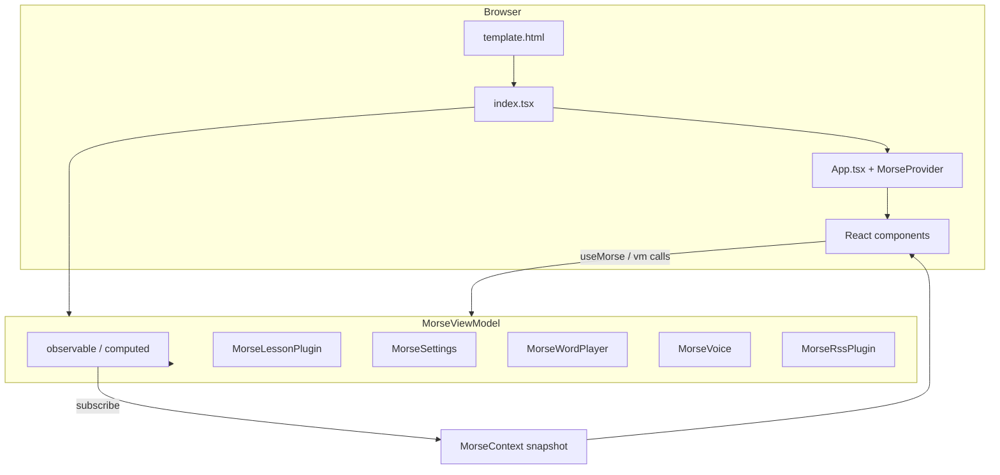

# MorseBrowser — Maintainer Guide: App Design & Content Flow

This document is for **future maintainers** who need to understand how the application is structured, how user-visible “content” moves through the system, and where to change behavior safely. It complements [DOCUMENTATION.md](../DOCUMENTATION.md) (feature reference) and [CLAUDE.md](../CLAUDE.md) (fork-specific changelog).

---

## 1. Purpose of this guide

- **What you will find here:** Verbose description of the **architecture**, the **React ↔ ViewModel bridge**, and **end-to-end flows** for lessons, text, and audio.
- **What you should read first:** [DOCUMENTATION.md](../DOCUMENTATION.md) §2–4 for stack and layout; this file goes deeper on **runtime behavior**.

---

## 2. Architectural summary

The app is a **static single-page application**. There is **no backend** for core practice logic.

| Layer | Role | Primary locations |
|--------|------|-------------------|
| **Shell** | Minimal HTML, theme bootstrap, `#react-root` | [`src/template.html`](../src/template.html) |
| **Entry** | Load Bootstrap/CSS, construct `MorseViewModel`, mount React | [`src/index.tsx`](../src/index.tsx), [`src/App.tsx`](../src/App.tsx) |
| **View (React)** | Layout, forms, accordions, accessibility live region | [`src/morse/components/`](../src/morse/components/) |
| **Bridge** | Mirror ViewModel observables → React state | [`src/morse/context/MorseContext.tsx`](../src/morse/context/MorseContext.tsx) |
| **ViewModel** | Single instance: practice state, playback orchestration, plugins | [`src/morse/morse.ts`](../src/morse/morse.ts) (`MorseViewModel`) |
| **Observables** | Reactive primitives (Knockout-like API, **not** the Knockout library) | [`src/morse/utils/observable.ts`](../src/morse/utils/observable.ts) |
| **Domain modules** | Lessons, settings, audio, voice, RSS, cookies, timing | Under [`src/morse/`](../src/morse/) |
| **Morse encoding** | SC Phillips–style libraries | [`src/morse-pro/`](../src/morse-pro/) |

**Design principle:** The **ViewModel remains the source of truth** for practice data. React reads through **`useMorse()`** and mutates through **`vm.*`** (observable setters and methods). Do not assume all state lives in React hooks.

---

## 3. Application bootstrap (startup sequence)

1. **HTML loads** — Inline script may set `data-bs-theme` from `localStorage` to avoid theme flash.
2. **`src/index.tsx`** runs:
   - Imports Bootstrap CSS and JS plugins used by collapse/tooltips.
   - Imports global styles [`src/css/style.css`](../src/css/style.css).
   - Creates **`new MorseViewModel()`** once (singleton for the page lifetime).
   - Removes the `#app-loading` element.
   - **`createRoot(document.getElementById('react-root')).render(<App vm={vm} />)`**
3. **`App`** wraps children in **`MorseProvider`** with that same `vm`.
4. **`MorseViewModel` constructor** (high level):
   - Builds **`MorseSettings`**, **`MorseLessonPlugin`** (with callbacks into `setText`, time estimates), **`MorseRssPlugin`**, **`MorseWordPlayer`**, **`MorseVoice`**, **`MorseShortcutKeys`**, **`CardBufferManager`**, etc.
   - Registers **cookie handlers** and restores persisted state.
   - Defines **computed** observables such as **`words`** (parsed from `rawText`).
   - Reads **query parameters** (`adminMode`, `rssEnabled`, `noiseEnabled`, …).
5. **`MorseProvider`** subscribes to **every observable** the UI needs (see `useKOBridge` in `MorseContext.tsx`). On any change, it **re-snapshots** the whole context value and **`setState()`**, so React re-renders.

**Maintainer note:** If you add a **new observable** the UI must display, you must **subscribe to it** in `useKOBridge` and add it to the **`snapshot()`** function and **`MorseContextValue`** type. Otherwise React will not update when that value changes.

---

## 4. React layout (where the UI lives)

[`AppContent.tsx`](../src/morse/components/app/AppContent.tsx) defines the vertical structure:

1. **Header** — Logo, title, dark mode, credits, dev links.
2. **BasicSettings** — High-frequency controls (speed, frequency, volume, etc.).
3. **WorkingText** — The main text area backing **`rawText`** / practice content.
4. **Accordion block**
   - **LessonsAccordion** — CLASS / LESSON / TYPE / letter group / presets (lesson cascade).
   - **MoreSettingsAccordion** — Expert options, noise, RSS (when enabled), trail, etc.
   - **FlaggedWordsAccordion** — Words flagged during playback.
5. **Controls** — Play, pause, stop, shuffle, navigation, loops.
6. **WordList** — Word cards / current word index.
7. **KeyboardShortcuts** — Reference table (also mirrors registered shortcuts from the ViewModel).

**Pattern:** Components call **`const { vm, … } = useMorse()`** and invoke **`vm.doPlay`**, **`vm.lessons.changeClass`**, etc. Display fields use **`morse.*`** snapshot fields (e.g. `lessons.selectedClass`) for read-only rendering.

---

## 5. Text and “words”: the central data path

### 5.1 `rawText` — the canonical practice string

- **`rawText`** observable holds the **full text** to practice (often newline-separated words or lines).
- **`words`** is a **computed** observable: it runs **`MorseStringUtils.getWords(rawText(), newlineChunking)`** and produces an array of **`WordInfo`** objects (display text, speech text, overrides, grouping metadata).
- **`currentIndex`** points at the **current word** within **`words()`** during playback.
- **`showingText`** / **`textBuffer`** / **`showRaw`** participate in what the user **sees** in the editor vs. derived display (see ViewModel for the exact binding rules).

**Flow:** Anything that loads a lesson ultimately **calls `setText(string)`** on the ViewModel, which updates **`rawText`** (and related fields). That automatically recomputes **`words`**.

### 5.2 Where `setText` is driven from

| Source | Mechanism |
|--------|-----------|
| **Lesson / preset selection** | `MorseLessonPlugin` receives **`setText`** callback in its constructor (`morse.ts` passes `(s) => this.setText(s)`). Selecting a lesson loads word-list content and applies preset overrides. |
| **User typing** | Working text component binds to ViewModel setters / observables (through React handlers). |
| **RSS plugin** | `MorseRssPlugin` uses `setText` from config when pulling feed content. |
| **Shuffle / flagged words** | ViewModel methods call **`setText`** with rebuilt strings. |
| **File import** | Handlers in `morse.ts` read files and **`setText`**. |

---

## 6. Lesson system: selection cascade (content flow)

**Module:** [`MorseLessonPlugin`](../src/morse/lessons/morseLessonPlugin.ts)

This is the **most intricate** part of the app. The user-facing cascade is:

**CLASS → (optional filters: TYPE, letter group) → LESSON → load word list + preset settings**

### 6.1 Observables involved

- **`selectedClass`** — e.g. BC1, INT1.
- **`userTarget`** — “TYPE” / audience filter (e.g. STUDENT).
- **`letterGroup`** — further narrows lists.
- **`selectedDisplay`** — one row from the lesson list (display name + internal file key); must **never** be left `undefined` when real code expects `.fileName`.
- **`displays`** — computed list of selectable lessons for the current class/filters. **Must not return an empty array:** a **dummy** “Select a lesson” option is used so the UI always has a valid selection.
- **`classes`**, **`letterGroups`**, **`userTargets`** — feed the dropdowns.

### 6.2 Initialization flags

The plugin uses flags such as **`displaysInitialized`** to avoid running certain selection logic **before** cookies and defaults have settled. The fork fixed a bug where resetting a flag inside **`displays`** recomputation could **lock** lesson updates; maintainers should avoid reintroducing side effects inside **computed** bodies.

### 6.3 Presets and overrides

- **Preset JSON** under [`src/presets/`](../src/presets/) defines **per-lesson** default settings.
- **`MorseSettingsHandler`** applies overrides when the lesson changes.
- **Settings presets** (“Your settings” vs saved presets) interact with **`settingsPresets`** and **`selectedSettingsPreset`**.

### 6.4 Build-time lesson resolution

At build time, **`prebuildLessons.ts`** (and related scripts) generate **static `require()` maps** so webpack can bundle every word list. Runtime code uses **`MorseLessonFileFinder`** (generated) to resolve a lesson key to file content. **Adding a new word list** requires updating the **wordlists index** and **preset sets**, then **rebuilding**.

---

## 7. Playback pipeline (audio content flow)

### 7.1 High-level loop

1. User triggers **`doPlay(playJustEnded, fromPlayButton)`** (from Controls, keyboard shortcuts, or internal continuation).
2. If **`rawText`** is empty, playback **returns immediately**.
3. **Fresh start** (from Play when idle): reset timers, **voice buffer**, **`cardBufferManager`**, **`charsPlayed`**, etc.
4. **`doPlay`** schedules work (with a small **`setTimeout`** in some cases) to allow pause/stop to interleave cleanly.
5. **`CardBufferManager.getNextMorse(...)`** returns the **next Morse string** to send to the audio layer for the **current card** — this coordinates **repeat counts**, **Speak First**, and **multi-part** cards.
6. **`getMorseStringToWavBufferConfig(text)`** builds a **`SoundMakerConfig`**: WPM/FWPM from **`settings.speed`**, frequencies, noise, envelopes, padding, **voice-related** trim flags, **`morseDisabled`**, etc.
7. **`morseWordPlayer.play(config, onEnded)`** — delegates to **`SmoothedSoundsPlayer`** or **`MorseWavBufferPlayer`** depending on `smoothing`.
8. **`playEnded`** implements the **state machine** for:
   - **Next word** vs **same card** (more Morse in buffer),
   - **Speak after** / **trail reveal** delays,
   - **Loop** and **end of session** (`doPause`).

### 7.2 Key collaborators

| Component | Responsibility |
|-----------|----------------|
| **`MorseWordPlayer`** | Abstraction over concrete sound makers; volume, noise, play/pause. |
| **`SoundMakerConfig`** | Everything the audio engine needs for one play invocation. |
| **`CardBufferManager`** | Splits practice into **cards** and **Morse chunks** for complex modes. |
| **`MorseVoice`** | Speak First / Speak After, **EasySpeech**, buffer limits, thinking time. |
| **`NoiseConfig`** | Pink/white/brown noise mixed in the sound maker. |

### 7.3 Timing

**PARIS / Farnsworth** math lives under [`src/morse/timing/`](../src/morse/timing/). The **audio** path consumes **milliseconds** computed from **WPM**, **FWPM**, and character/word counts.

---

## 8. Settings and persistence

- **`MorseSettings`** groups **speed**, **frequency**, **misc** (volume, spacing, etc.).
- **Cookie handlers** implement **`ICookieHandler`**: `save`, `load`, `getKey`.
- **`MorseCookies`** registers handlers and coordinates **load on startup** and **save** after changes.
- **`localStorage`** is used for **theme** (see Header / template script).

When you add a **persisted** setting, you typically wire it through **settings** + **cookie handler** + **MorseContext** snapshot + **React** control.

---

## 9. Secondary features (how they attach)

| Feature | Entry point | Notes |
|---------|-------------|-----|
| **RSS** | `MorseRssPlugin`, `RssConfig`, `?rssEnabled=true` | Fetches text; can call into **`setText`**, **`doPlay`**, rewind helpers. |
| **Noise** | `NoiseConfig`, sound maker | Gated by UI and query params. |
| **Flagged words** | `FlaggedWords` | User can load flagged text back into **`rawText`**. |
| **Shortcuts** | `MorseShortcutKeys` | Registers shortcuts in the ViewModel; **KeyboardShortcuts** shows `allShortcutKeys`. |
| **Screen wake lock** | `ScreenWakeLock` | Keeps screen on during long sessions. |

---

## 10. Build pipeline vs runtime (content at build time)

- **`npm run prebuild`** runs TypeScript scripts that **scan** `wordfiles/`, `presets/`, etc. and emit **finder** modules with static imports.
- **`npm run build`** runs webpack in **production** mode (minify, content hashes, PurgeCSS in prod).
- **`npm run postbuild`** zips **`dist/`** and runs **`checklessons.js`** validation.

**Rule:** If you add assets that must be **bundled**, ensure the **prebuild** step **discovers** them; dynamic `import(variable)` will not work without bundler support.

---

## 11. Testing boundaries

- **`npm test`** (Vitest) covers **pure** modules: timing, string utils, morse-pro helpers, **WordInfo** parsing.
- **UI**, **Web Audio**, **speech**, and **full lesson + React integration** are **manual** or require future E2E tooling.

See [CLAUDE.md](../CLAUDE.md) § Testing for the project’s philosophy.

---

## 12. Common pitfalls for maintainers

1. **Empty lesson list** — `displays` returning `[]` can leave **`selectedDisplay`** invalid. Always keep a **dummy** row when no real lesson matches.
2. **Forgotten context subscription** — New observable not added to **`MorseContext`** → UI **stale** until something else triggers a bump.
3. **Side effects in `computed`** — Can cause **infinite loops** or subtle **lockouts** (lesson bug fix). Keep computeds **pure** aside from deliberate, documented patterns.
4. **`doPlay` / `playEnded`** — Complex **async** timing; small changes can break **pause**, **Speak First**, or **trail**. Test with **voice on/off** and **multi-word cards**.
5. **DOM IDs** — Some code still uses **`document.getElementById`** (e.g. accordion toggles). Renaming IDs in React components can **break** imperative calls.

---

## 13. Suggested reading order for new maintainers

1. [`src/index.tsx`](../src/index.tsx) → [`src/App.tsx`](../src/App.tsx) → [`AppContent.tsx`](../src/morse/components/app/AppContent.tsx)
2. [`MorseContext.tsx`](../src/morse/context/MorseContext.tsx) — `snapshot` + `useKOBridge` subscription list
3. [`morse.ts`](../src/morse/morse.ts) — `setText`, `words` computed, `doPlay`, `playEnded`, `getMorseStringToWavBufferConfig`
4. [`morseLessonPlugin.ts`](../src/morse/lessons/morseLessonPlugin.ts) — lesson cascade
5. [`morseWordPlayer.ts`](../src/morse/player/morseWordPlayer.ts) + one sound maker implementation

---

## 14. Document history

This guide was added to give maintainers a **single narrative** for architecture and **content flow**. For version-specific fork changes, continue to use [CLAUDE.md](../CLAUDE.md) and [DOCUMENTATION.md](../DOCUMENTATION.md).
